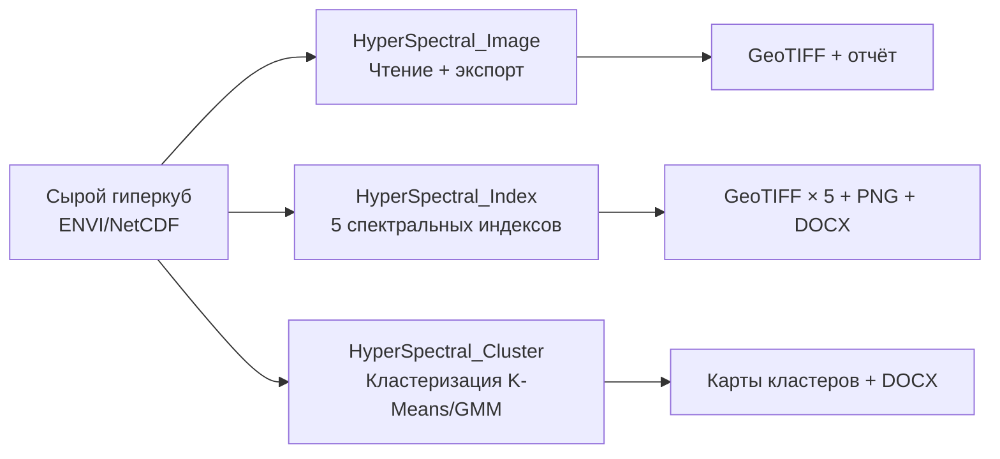

# Полный отчёт по репозиторию HyperSpectral

**Дата:** 2026-06-25  
**Репозиторий:** [Dmitry-Viktorov/Hyperspectral_Cluster](https://github.com/Dmitry-Viktorov/Hyperspectral_Cluster)  
**Среда:** Python 3.13, Windows, GDAL 3.12, scikit-learn 1.8

---

## Оглавление

1. [Обзор репозитория](#1-обзор-репозитория)
2. [Проект Hyperspectral_Image](#2-проект-hyperspectral_image)
3. [Проект HyperSpectral_Index](#3-проект-hyperspectral_index)
4. [Проект HyperSpectral_Cluster](#4-проект-hyperspectral_cluster)
5. [Сравнительный анализ проектов](#5-сравнительный-анализ-проектов)
6. [Используемые технологии и библиотеки](#6-используемые-технологии-и-библиотеки)
7. [Датасеты](#7-датасеты)
8. [Список литературы](#8-список-литературы)

---

## 1. Обзор репозитория

Репозиторий HyperSpectral представляет собой **учебный пайплайн полного цикла обработки гиперспектральных данных** — от чтения сырых снимков до автоматической генерации научных отчётов. Три вложенных проекта последовательно усложняют анализ:

| Проект | Назначение | Ключевая идея |
|--------|-----------|---------------|
| **Hyperspectral_Image** | Чтение, экспорт и анализ метаданных | Конвертация NetCDF→GeoTIFF + сравнение 3 форматов метаданных |
| **HyperSpectral_Index** | Расчёт спектральных индексов | Свёртка 425-мерного спектра в 5 индексов с физической интерпретацией |
| **HyperSpectral_Cluster** | Неконтролируемая сегментация | Кластеризация 425-мерных векторов reflectance без Ground Truth |



---

## 2. Проект Hyperspectral_Image

### 2.1 Назначение

**Цель:** Реализовать конвейер чтения гиперспектрального куба из формата NetCDF (`.nc`), экспорта в многополосный GeoTIFF (`.tif`) и сравнительного анализа метаданных между тремя источниками: NetCDF, GeoTIFF и паспортные файлы (`.rsp`).

### 2.2 Датасет

Используется гиперспектральный куб в формате NetCDF:

| Параметр | Значение |
|----------|---------|
| Файл | `AV320241005t175313_005_L1B_RDN_f6524bfe_RDN.nc` |
| Размерность | 284 канала × 1280 строк × 1234 столбцов |
| Тип данных | Radiance (L1B) |
| Диапазон длин волн | 389.76 – 2493.48 нм |
| Единицы radiance | `uW nm⁻¹ cm⁻² sr⁻¹` |
| Группа NetCDF | `radiance` |
| Доп. переменные | `fwhm`, `wavelength` |

Дополнительно — два паспортных файла `.rsp` в XML-формате для сравнения метаданных.

### 2.3 Архитектура скрипта

Основной скрипт: `docs/unpack_hyperspectral.py` (~700 строк).

**Ключевые функции:**

| Функция | Назначение |
|---------|-----------|
| `get_dataset_metadata(ds)` | Извлечение нормализованных ключей и значений из NetCDF |
| `get_tiff_metadata_sets(tiff_info)` | Извлечение метаданных из GeoTIFF |
| `parse_rsp_file(file_path)` | Парсинг XML-паспорта (`.rsp`) через `xml.etree.ElementTree` |
| `flatten_xml(element)` | Рекурсивное «уплощение» XML-дерева в словарь |
| `normalize_label(text)` | Нормализация строк для сравнения: нижний регистр, удаление спецсимволов |
| `export_to_tiff(ds, output_path)` | Экспорт NetCDF→GeoTIFF через GDAL (284 полосы, float32) |
| `write_metadata_report(...)` | Генерация подробного текстового отчёта |
| `write_summary_report(...)` | Генерация краткого резюме |

### 2.4 Методология: сравнение метаданных

Ключевая идея проекта — **exact-match сравнение** нормализованных метаданных между тремя форматами. Процесс:

```
1. NetCDF (.nc)
   └─ get_dataset_metadata() → {keys}, {values}
   
2. GeoTIFF (.tif)  
   └─ get_tiff_metadata_sets() → {keys}, {values}
   
3. Паспорт (.rsp)
   └─ parse_rsp_file() → flatten_xml() → {keys}, {values}
   
4. Попарные пересечения:
   NC ∩ TIFF, NC ∩ RSP, TIFF ∩ RSP, NC ∩ TIFF ∩ RSP
```

**Нормализация строк:**
```python
def normalize_label(text):
    if text is None:
        return ''
    return re.sub(r'[^0-9a-z]+', ' ', str(text).lower()).strip()
```

Эта функция приводит все метаданные к единому формату: нижний регистр, удаление не-буквенно-цифровых символов, обрезка пробелов.

### 2.5 Результаты: почему пересечений нет

Результат **нулевых пересечений** между `.nc`, `.tif` и `.rsp` — это **не ошибка**, а валидный аналитический вывод:

1. **Разные модели метаданных:** NetCDF хранит научные атрибуты (`units`, `standard_name`, `long_name`), GeoTIFF — растровые поля (`driver`, `projection`, `geotransform`), RSP — аппаратную телеметрию
2. **Строгое сравнение:** скрипт не использует словарь синонимов (например, `wavelength` ↔ `длина_волны`)
3. **Разный уровень детализации:** NetCDF содержит спектральные атрибуты, RSP — временные метки и телеметрию

**Значение вывода:** нулевой результат показывает, что для сопоставления метаданных разных форматов необходим семантический маппинг (словарь соответствий), а не буквальное сравнение строк.

### 2.6 Конвейер экспорта NetCDF → GeoTIFF

Экспорт выполняется через GDAL:

```python
def export_to_tiff(ds, output_path):
    bands, rows, cols = ds['radiance'].shape
    driver = gdal.GetDriverByName('GTiff')
    tiff_ds = driver.Create(output_path, cols, rows, bands, gdal.GDT_Float32)
    
    for b in range(bands):
        band_data = ds['radiance'].values[b, :, :]
        tiff_ds.GetRasterBand(b + 1).WriteArray(band_data)
```

**Важно:** CRS и геопривязка в исходном NetCDF **отсутствуют** — в TIFF они также не появятся. Это ограничение исходных данных, а не ошибка скрипта.

### 2.7 Аргументы командной строки

Скрипт поддерживает гибкие флаги:

| Флаг | Действие |
|------|---------|
| `--no-tiff` | Не пересоздавать TIFF (анализ существующего) |
| `--no-plot` | Не строить графики (Band 1 + спектр пикселя) |
| `--no-report` | Не писать детальный отчёт |
| `--no-summary` | Не писать краткий отчёт |
| `--output-tiff <путь>` | Изменить путь выходного TIFF |

---

## 3. Проект HyperSpectral_Index

### 3.1 Назначение

**Цель:** Разработать воспроизводимый Python-пайплайн для расчёта и визуализации **пяти верифицированных спектральных индексов** по гиперспектральному снимку AVIRIS-NG (surface reflectance) с последующей оценкой достоверности классификации через анализ внутриклассовой однородности.

### 3.2 Используемый датасет

Переход от radiance (Hyperspectral_Image) к **surface reflectance** — данным после атмосферной коррекции:

| Параметр | Значение |
|----------|---------|
| Сцена | `ang20160831t201002_rfl_v1n2` |
| Сенсор | AVIRIS-NG (Airborne Visible/Infrared Imaging Spectrometer) |
| Формат | ENVI (`.img` + `.hdr`), interleave = BIL |
| Тип данных | Float32 surface reflectance |
| Размерность | 425 полос × 5485 строк × 700 столбцов |
| Диапазон длин волн | 376.4 – 2500.1 нм |
| NoData | −9999 |
| Scale factor | 1.0 (данные уже в [0, 1]) |
| Дата съёмки | 31 августа 2016 |
| Местоположение | Миддлтон / Шорвуд Хилс, Висконсин, США |

**Гетерогенность сцены:** озеро Мендота (вода), лесопарковые зоны (густая растительность), поля для гольфа (разреженная растительность), жилая застройка, дороги, открытые почвы.

### 3.3 Архитектура: 7 скриптов

| Скрипт | Роль | ~ строк |
|--------|------|---------|
| `unpack_dataset.py` | Распаковка `tar.gz` архива | 30 |
| `io_envi.py` | Чтение ENVI-куба, поиск полос, запись GeoTIFF | 250 |
| `indices.py` | Определения 5 индексов + формулы расчёта | 250 |
| `visualization.py` | Визуализация (RGB+карта+легенда) в стиле Ресурс-П | 250 |
| `compute_indices.py` | **Главный пайплайн** — оркестрация расчёта | 180 |
| `evaluate_homogeneity.py` | Оценка внутриклассовой однородности | 400 |
| `generate_report.py` | Генератор DOCX-отчёта | 300 |

### 3.4 Модуль `indices.py` — ядро проекта

Пять индексов определены через датакласс `IndexDefinition`:

```python
@dataclass(frozen=True)
class IndexDefinition:
    name: str                # "NDVI"
    full_name: str           # "Normalized Difference Vegetation Index"
    description: str         # Что измеряет
    wavelength_a_nm: float   # Полоса числителя
    wavelength_b_nm: float   # Полоса знаменателя
    formula_str: str         # Человеко-читаемая формула
    source_short: str        # Автор, год, журнал
    source_doi: str          # DOI URL
    classes: tuple[RangeClass, ...]  # Дискретные классы с цветами
```

Каждый класс (`RangeClass`) содержит:
- `lo`, `hi` — границы диапазона
- `label` — физическая интерпретация (например, «Вода, снег, бетон»)
- `color` — HEX-код цвета для дискретной палитры

#### 3.4.1 NDVI — Normalized Difference Vegetation Index

**Авторы:** Rouse, Haas, Schell & Deering (1974)  
**Источник:** NASA Technical Report, NASA-CR-351575  
**DOI:** https://ntrs.nasa.gov/citations/19740022614

**Формула:**
```
NDVI = (R₈₆₀ − R₆₇₀) / (R₈₆₀ + R₆₇₀)
```

**Физический смысл:** Здоровая растительность сильно отражает в ближнем ИК (NIR, 860 нм) и поглощает в красном (RED, 670 нм) за счёт хлорофилла. Чем больше разница, тем выше NDVI.

**Диапазоны интерпретации:**

| Диапазон | Интерпретация |
|----------|--------------|
| < 0.00 | Вода, снег, бетон, асфальт, кровля |
| 0.00–0.10 | Оголённый грунт, пески, сухое русло |
| 0.10–0.25 | Сухая/разреженная растительность |
| 0.25–0.40 | Умеренная растительность, кустарники, луга |
| 0.40–0.60 | Густая растительность, леса, плантации |
| > 0.60 | Максимально плотная здоровая биомасса |

#### 3.4.2 NDWI (Gao) — Normalized Difference Water Index

**Автор:** Gao, B.-C. (1996)  
**Источник:** Remote Sensing of Environment, 58(3), 257–266  
**DOI:** https://doi.org/10.1016/S0034-4257(96)00067-3

**Формула:**
```
NDWI = (R₈₆₀ − R₁₂₄₀) / (R₈₆₀ + R₁₂₄₀)
```

**Физический смысл:** Вода в растительном пологе поглощает в SWIR-1 (1240 нм), но не в NIR (860 нм). Чем больше содержание воды, тем выше NDWI.

**Адаптация порогов под AVIRIS surface reflectance:** для данного датасета вода даёт NDWI ≈ +0.25 (а не +0.40 как в литературе для Landsat TOA), т.к. на surface reflectance NIR ≈ 0 и SWIR1 ≈ 0 для воды. Порог «открытая вода» снижен с 0.35 до 0.25.

#### 3.4.3 MNDWI — Modified Normalized Difference Water Index

**Автор:** Xu, H. (2006)  
**Источник:** International Journal of Remote Sensing, 27(14), 3025–3033  
**DOI:** https://doi.org/10.1080/01431160600589179

**Формула:**
```
MNDWI = (R₅₆₀ − R₁₆₁₀) / (R₅₆₀ + R₁₆₁₀)
```

**Ключевое отличие от NDWI:** использует **зелёный канал** (560 нм) вместо NIR (860 нм). Это **подавляет сигнал застройки**: здания отражают в NIR сильнее, чем в зелёном, поэтому NDWI может ложно классифицировать их как воду. MNDWI лишён этого недостатка.

#### 3.4.4 NDBI — Normalized Difference Built-up Index

**Автор:** Zha, Gao & Ni (2003)  
**Источник:** Int. J. Remote Sensing, 24(3), 583–594  
**DOI:** https://doi.org/10.1080/01431160304987

**Формула:**
```
NDBI = (R₁₆₁₀ − R₈₆₀) / (R₁₆₁₀ + R₈₆₀)
```

**Физический смысл:** Застроенные поверхности (асфальт, бетон, крыши) имеют более высокое отражение в SWIR (1610 нм), чем в NIR (860 нм). Растительность — наоборот. NDBI положителен для застройки и отрицателен для растительности.

**Адаптация:** на AVIRIS surface reflectance SWIR < NIR даже для застройки (88% пикселей), поэтому пороги агрессивно адаптированы: не-растительность (NDVI < 0.2) имеет NDBI > 0.03 лишь у 37.5% пикселей.

#### 3.4.5 PRI — Photochemical Reflectance Index

**Автор:** Gamon, Peñuelas & Field (1992)  
**Источник:** Remote Sensing of Environment, 41(1), 35–44  
**DOI:** https://doi.org/10.1016/0034-4257(92)90059-S

**Формула:**
```
PRI = (R₅₃₁ − R₅₇₀) / (R₅₃₁ + R₅₇₀)
```

**Физический смысл:** Узкополосный индекс, отслеживающий **ксантофилловый цикл** — механизм защиты растений от избыточного освещения. При стрессе ксантофиллы накапливаются, поглощая на 531 нм, и PRI падает. Это единственный индекс, работающий в видимом диапазоне с разницей всего в 39 нм между каналами.

### 3.5 Модуль `io_envi.py` — работа с ENVI

Ключевой класс — `EnviCubeReader`:

```python
@dataclass(frozen=True)
class EnviSceneInfo:
    image_path: Path
    header_path: Path
    samples: int          # Ширина (700)
    lines: int            # Высота (5485)
    bands: int            # Полос (425)
    wavelengths_nm: np.ndarray   # Центры полос в нм
    nodata_value: float | None   # −9999
    scale_factor: float          # 1.0 (surface reflectance уже в [0,1])

class EnviCubeReader:
    def read_band(self, band_index: int) -> np.ndarray:
        """Чтение одной полосы (0-based) → float32, NoData→NaN"""
    
    def read_rgb(self, r_nm=660, g_nm=550, b_nm=460) -> np.ndarray:
        """RGB через процентильную растяжку (2–98%)"""
```

**Вспомогательные функции:**

```python
def find_nearest_band(wavelengths_nm, target_nm) -> tuple[int, float]:
    """Поиск ближайшей полосы к целевой длине волны → (индекс, нм)"""

def write_tiff(path, data, src_dataset, metadata):
    """Запись GeoTIFF с метаданными через GDAL"""
```

### 3.6 Алгоритм расчёта индекса

Все 5 индексов вычисляются по единой формуле **нормализованной разности**:

```python
def compute_normalized_difference(band_a, band_b, min_sum=0.01):
    a, b = np.float32(band_a), np.float32(band_b)
    denom = a + b
    valid = np.abs(denom) >= min_sum        # Исключение шума/теней
    result = np.where(valid & (denom != 0), (a - b) / denom, np.nan)
    result[~np.isfinite(result)] = np.nan
    result = np.clip(result, -1.0, 1.0)     # Теоретические границы
    return result
```

**Параметр `min_sum`:**
- `0.010` — стандарт (NDVI, MNDWI, NDBI, PRI): исключает пиксели с |A+B| < 0.01
- `0.003` — NDWI: снижен для захвата водных пикселей (NIR ≈ SWIR1 ≈ 0)

### 3.7 Визуализация в стиле КА «Ресурс-П»

Формат вывода (из `visualization.py`, функция `save_index_visualization`):

```
┌──────────────────────────────────────────────────────┐
│             ЗАГОЛОВОК: Индекс | Сцена                 │
├────────────────────┬─────────────────────────────────┤
│    RGB сцена       │      Карта индекса               │
├────────────────────┴─────────────────────────────────┤
│  [████████████████████████████████████████████████]   │ ← colorbar
│  -1.0       0.0       0.25      0.40      1.0        │
│                                                       │
│  ┌──────┬──────┬──────┐  ┌──────┬──────┬──────┐      │ ← таблица легенды
│  │ ████ │ ████ │ ████ │  │ ████ │ ████ │ ████ │      │   2 ряда × 3 ячейки
│  │Water │ Soil │ Veg  │  │Mod.V │Dense │Max.B │      │   равной ширины
│  └──────┴──────┴──────┘  └──────┴──────┴──────┘      │
│                                                       │
│  Источник: Author (Year)  |  DOI                       │
└──────────────────────────────────────────────────────┘
```

Разрешение: **1536×1536 пикселей, 150 dpi**. Индивидуальная дискретная палитра для каждого индекса.

### 3.8 Оценка достоверности: внутриклассовая однородность

Модуль `evaluate_homogeneity.py` решает проблему: одинаковое значение индекса **не гарантирует**, что пиксели относятся к одному физическому типу поверхности. Разные объекты могут случайно иметь близкие значения одного индекса, но отличаться по полной спектральной сигнатуре.

**Метрики:**

1. **`mean_corr`** — средний коэффициент корреляции Пирсона между спектрами пикселей внутри класса:
   ```
   mean_corr = mean( corrcoef(class_spectra) ), исключая диагональ
   ```
   Оценивает **сходство формы** спектральной кривой. Высокий mean_corr → пиксели имеют похожую форму спектра.

2. **`mean_std`** — среднее абсолютное СКО по всем спектральным полосам внутри класса:
   ```
   mean_std = mean( nanstd(class_spectra, axis=0) ), без нормализации
   ```
   Оценивает **разброс абсолютных значений** reflectance. Низкий mean_std → пиксели близки по яркости.

**Алгоритм:**

```python
def extract_class_spectra(cube_reader, label_map, class_id, max_pixels=3000, seed=42):
    """Извлечь спектры пикселей класса (с воспроизводимой выборкой для больших классов)"""
    rows, cols = np.where(label_map == class_id)
    # Для больших классов: случайная выборка max_pixels пикселей (seed=42)
    # Чтение полос ОДНИМ проходом (оптимизация):
    #   - corr: все полосы для сэмплированных пикселей
    #   - std: векторизованный bincount по всем валидным пикселям
```

**Полосы водяного поглощения** (1350–1450 нм, 1800–1950 нм) **исключаются** — в этих диапазонах атмосферное пропускание близко к нулю, reflectance является шумом.

**Пороги качества:**
- `mean_corr ≥ 0.90` → «очень однородный класс, спектры почти одинаковой формы»
- `mean_corr ≥ 0.75` → «достаточно однородный класс»
- `mean_corr ≥ 0.50` → «смешанный класс, возможны разные типы объектов»
- `mean_corr < 0.50` → «неоднородный класс, требует проверки»
- `pixel_count < 30` → «малочисленный класс, оценка ненадёжна»

### 3.9 Результаты расчёта индексов

Итоговая статистика по сцене Миддлтон:

| Индекс | min | max | mean | std | Valid |
|--------|-----|-----|------|-----|-------|
| NDVI | −0.85 | 0.94 | 0.40 | 0.50 | 87.8% |
| NDWI | −0.63 | 1.00 | 0.09 | 0.13 | 88.5% |
| MNDWI | −0.84 | 1.00 | −0.08 | 0.58 | 89.3% |
| NDBI | −1.00 | 0.59 | −0.29 | 0.20 | 69.6% |
| PRI | −0.35 | 0.63 | −0.005 | 0.04 | 89.5% |

Фактические длины волн (ближайшие полосы AVIRIS-NG):

| Индекс | Цель A | Факт A | ΔA | Цель B | Факт B | ΔB |
|--------|--------|--------|-----|--------|--------|-----|
| NDVI | 860 | 862.28 | +2.28 | 670 | 671.95 | +1.95 |
| NDWI | 860 | 862.28 | +2.28 | 1240 | 1237.93 | −2.07 |
| MNDWI | 560 | 561.76 | +1.76 | 1610 | 1608.57 | −1.43 |
| NDBI | 1610 | 1608.57 | −1.43 | 860 | 862.28 | +2.28 |
| PRI | 531 | 531.71 | +0.71 | 570 | 571.78 | +1.78 |

Все отклонения ≤ 2.3 нм — в допустимых пределах.

### 3.10 Выходные продукты

| Продукт | Формат | Расположение |
|---------|--------|-------------|
| Карты индексов | GeoTIFF (float32) × 5 | `results/indices/` |
| Визуализации | PNG (1536×1536, 150 dpi) × 6 | `results/indices_preview/` |
| Легенды | PNG × 5 | `results/legends/` |
| Статистика | CSV × 1 | `results/metadata/index_summary.csv` |
| Оценка однородности | CSV + Markdown | `results/metadata/class_homogeneity.*` |
| Отчёт | DOCX | `reports/report.docx` |

---

## 4. Проект HyperSpectral_Cluster

### 4.1 Назначение

**Цель:** Разработать воспроизводимый пайплайн **неконтролируемой спектральной сегментации** гиперспектрального снимка AVIRIS-NG методами кластерного анализа без использования размеченной выборки (Ground Truth).

### 4.2 Используемый датасет

Тот же, что в HyperSpectral_Index — `ang20160831t201002_rfl_v1n2`. Это осознанное решение: кластеризация дополняет индексный анализ, работая на тех же данных, но принципиально иным методом.

### 4.3 Архитектура

| Скрипт | Роль | ~ строк |
|--------|------|---------|
| `cluster_segmentation.py` | Главный пайплайн (3 варианта K-Means + GMM) | 1300 |
| `generate_cluster_report.py` | Генератор DOCX-отчёта | 500 |

### 4.4 Ключевая инновация: BIL-оптимизация через numpy memmap

Файл ENVI имеет формат **BIL** (Band Interleaved by Line). При «наивном» чтении через GDAL каждая полоса читается отдельно, что вызывает 425 отдельных операций seek по 6.5 GB файлу — **крайне медленно** (десятки минут).

**Решение:** прямой доступ через `numpy.memmap`:

```python
raw = np.memmap(
    img_path, dtype=np.float32, mode='r',
    shape=(info.lines, info.bands, info.samples),  # (5485, 425, 700) — BIL layout
)
```

Чтение строки (всех 425 полос) из memmap — **доли миллисекунды** (создаётся view, реальное чтение — при `.copy()`):

```python
row_data = np.array(raw[r, :, :], dtype=np.float32, copy=True)  # 425×700 float32 = 1.2 MB
```

Это даёт ускорение на порядки: полный проход по 5485 строкам с PCA-трансформацией занимает ~2 минуты вместо десятков минут при GDAL.

### 4.5 Предобработка данных

```
1. Маскирование NoData (−9999 → NaN) и исключение пикселей с NaN
2. Исключение полос водяного поглощения (1350–1450 нм, 1800–1950 нм)
3. Субдискретизация полос: band_step=3 → 125 полос (из 375 валидных)
4. PCA: 125 полос → 30 компонент (сохраняется >99.99% дисперсии)
5. Случайная выборка 100 000 пикселей для обучения (seed=42)
```

### 4.6 Мера сходства: косинусное расстояние

**Ключевое решение:** вместо евклидова расстояния используется **косинусное** (Spectral Angle Mapper):

```python
from sklearn.preprocessing import normalize
data_norm = normalize(data_reduced.astype(np.float64), norm='l2')
```

L2-нормализация проецирует все спектры на единичную гиперсферу, после чего евклидово расстояние эквивалентно косинусному:

$$\text{cosine\_distance}(x, y) = 1 - \frac{x \cdot y}{\|x\|_2 \|y\|_2}$$

$$\text{euclidean\_distance}(x_{norm}, y_{norm}) \propto \sqrt{2 \cdot \text{cosine\_distance}(x, y)}$$

**Преимущество:** акцент на **форме** спектральной кривой, а не на абсолютной яркости. Устойчивость к вариациям освещённости и частичному затенению.

### 4.7 Алгоритм 1: MiniBatchKMeans

Оптимизированная версия Lloyd's K-Means (MacQueen, 1967) из scikit-learn:

```python
km = MiniBatchKMeans(
    n_clusters=n_clusters,
    random_state=42,
    batch_size=10_000,
    max_iter=100,
    n_init=3,
    reassignment_ratio=0.01,
)
```

Минимизирует within-cluster sum of squares (WCSS = inertia). Разбивает пространство reflectance на K сферических кластеров. Базовый, хорошо интерпретируемый референсный метод.

### 4.8 Алгоритм 2: Gaussian Mixture Model

Вероятностная модель (Dempster, Laird & Rubin, 1977):

```python
gmm = GaussianMixture(
    n_components=n_clusters,
    covariance_type="diag",    # Диагональная ковариация (устойчивость)
    random_state=42,
    max_iter=200,
    n_init=3,
    reg_covar=1e-4,            # Регуляризация ковариации
    init_params="k-means++",
)
```

**Преимущества перед K-Means:**
1. **Мягкая (soft) кластеризация:** каждый пиксель получает вероятности принадлежности ко всем кластерам
2. **Оценка неопределённости:** карта `1 − max_prob` показывает, где GMM не уверен
3. **Эллипсоидальные кластеры:** диагональная ковариация позволяет кластерам иметь разную дисперсию по разным PCA-компонентам

### 4.9 Три варианта K-Means (сравнительный анализ)

#### Вариант 1 — k-means++ (стандартный)

Классическая инициализация: центроиды выбираются последовательно с вероятностью, пропорциональной квадрату расстояния до ближайшего уже выбранного центроида. Случайная равномерная выборка 100 000 пикселей.

#### Вариант 2 — кастомные центроиды (custom centroid init)

Инициализация центроидов **заданными пикселями снимка**. Вместо вероятностного выбора k-means++ центроиды явно задаются как медианные пиксели из 8 равномерных бинов первой главной компоненты (PC1):

```python
pc1 = data_norm[:, 0]
bins = np.linspace(pc1.min(), pc1.max(), n_clusters + 1)
for k in range(n_clusters):
    in_bin = np.where((pc1 >= bins[k]) & (pc1 < bins[k + 1]))[0]
    centroid_idx.append(int(in_bin[len(in_bin) // 2]))  # медианный пиксель бина

km = MiniBatchKMeans(n_clusters=n_clusters, init=init_centroids, n_init=1, ...)
```

Это гарантирует, что начальные центроиды **равномерно покрывают спектральный диапазон** сцены — от воды (низкая PC1) до густой растительности (высокая PC1).

#### Вариант 3 — стратифицированная выборка (stratified sampling)

Обучающая выборка формируется не случайно-равномерно, а стратифицированно — по 12 500 пикселей из каждого из 8 бинов PC1:

```python
for k in range(n_clusters):
    in_bin = np.where((pc1 >= bins[k]) & (pc1 < bins[k + 1]))[0]
    n_take = min(samples_per_cluster[k], len(in_bin))
    stratified_idx.extend(rng.choice(in_bin, n_take, replace=False).tolist())
```

Это обеспечивает равное представительство всех спектральных диапазонов, что важно при сильном дисбалансе классов (вода занимает ~40% сцены).

#### Результаты сравнения (K=8, cosine distance)

| Вариант | Inertia ↓ | Silhouette ↑ | Davies-Bouldin ↓ |
|---------|-----------|-------------|-------------------|
| k-means++ (default) | 4879 | 0.526 | 0.766 |
| **Custom centroids** | **4640** | **0.547** | **0.743** |
| Stratified sampling | 4879 | 0.526 | 0.766 |
| *GMM (референс)* | — | 0.364 | 2.061 |

**Вывод:** Кастомные центроиды из PC1-бинов улучшают **все** метрики — силуэт на 4%, DB на 3%, inertia на 5%. Стратифицированная выборка не дала значимого отличия при хорошей сходимости K-Means на данном датасете.

### 4.10 Кросс-референс с индексами и интерпретация кластеров

Для каждого кластера автоматически вычисляются средние значения всех 5 спектральных индексов из `HyperSpectral_Index`. Затем применяется функция `_dominant()`:

```python
def _dominant(r):
    ndvi = r.get("mean_ndvi")
    mndwi = r.get("mean_mndwi")
    ndbi = r.get("mean_ndbi")
    ndwi_val = r.get("mean_ndwi")

    if ndvi < 0.0 and mndwi > 0.3:    return "открытая вода"
    if mndwi > 0.6:                    return "открытая вода"
    if ndbi > 0.05 and ndvi < 0.25:    return "застройка / искусств. покрытия"
    if ndvi > 0.55:                    return "густая растительность"
    if ndvi > 0.30:                    return "умеренная растительность"
    if ndvi > 0.10:                    return "разреженная растительность"
    if ndwi_val < -0.06:               return "сухой грунт / почва"
    return "смешанный / переходный"
```

**Порядок проверок важен:** вода проверяется первой (NDVI < 0 **И** MNDWI > 0.3 — оба условия), затем застройка (NDBI > 0.05 при низком NDVI), затем градации растительности по NDVI.

### 4.11 Единая цветовая схема

Вместо произвольных цветов, привязанных к `cluster_id`, используется **единая палитра на основе физического класса**:

```python
UNIFIED_PALETTE = [
    "#2166ac",  # вода (тёмно-синий)
    "#4393c3",  # вода / влажные зоны (светло-синий)
    "#d73027",  # застройка (красный)
    "#fc8d59",  # сухой грунт (оранжевый)
    "#ffffbf",  # разреженная растительность (светло-жёлтый)
    "#a6d96a",  # умеренная растительность (светло-зелёный)
    "#1a9850",  # густая растительность (средне-зелёный)
    "#006d2c",  # очень густая растительность (тёмно-зелёный)
]
```

Функция `_assign_unified_color(dominant_class, mean_ndvi)` назначает цвет по классу и NDVI. Благодаря этому кластеры одного физического класса **визуально одинаковы** на картах всех методов (K-Means++, K-Means custom, K-Means stratified, GMM).

### 4.12 Результаты кластеризации (K-Means, K=8)

| Кластер | Доля | NDVI | MNDWI | Интерпретация |
|---------|------|------|-------|---------------|
| C0 | 6.3% | +0.233 | −0.334 | Застройка / искусств. покрытия |
| C1 | 39.0% | −0.035 | **+0.519** | Открытая вода (оз. Мендота) |
| C2 | 23.2% | +0.837 | −0.537 | Густая растительность |
| C3 | 13.6% | +0.862 | −0.510 | Густая растительность |
| C4 | 3.9% | +0.832 | −0.442 | Густая растительность |
| C5 | 6.2% | +0.574 | −0.460 | Густая растительность |
| C6 | 3.9% | +0.173 | −0.269 | Разреженная растительность |
| C7 | 4.0% | +0.193 | −0.182 | Разреженная растительность |

### 4.13 Единая сравнительная легенда (кросс-методная)

Для сравнения результатов разных методов строится таблица соответствия «физический класс → ID кластера в каждом методе»:

| Физический класс | K-Means++ | Custom centroids | Stratified | GMM |
|-----------------|-----------|-----------------|------------|-----|
| Открытая вода | C1 (−0.04) | C0 (−0.05) | C1 (−0.04) | C0 (−0.24) |
| Застройка | C0 (+0.23) | — | C0 (+0.23) | C4 (+0.18) |
| Густая раст-ть | C2,C3,C4,C5,C7 | C2,C5,C6,C7 | C2–C5,C7 | C1,C2,C3,C5 |
| Разреженная | C6,C7 | C1,C3,C4 | C6,C7 | C7 |

**Наблюдение:** GMM выделяет «умеренную растительность» (C6, C7) как отдельную категорию, которую K-Means не различает — она распределена между «густой» и «разреженной».

### 4.14 Выходные продукты

| Продукт | Формат | Расположение |
|---------|--------|-------------|
| Карты кластеров | GeoTIFF (int16) × 6 | `results/clusters/` |
| Карта неопределённости GMM | GeoTIFF (float32) × 2 | `results/clusters/` |
| Визуализации | PNG × 6 | `results/cluster_previews/` |
| Легенды | PNG × 6 | `results/legends/` |
| Таблицы кластеров | CSV × 5 | `results/metadata/` |
| Отчёт | DOCX | `reports/cluster_report.docx` |

---

## 5. Сравнительный анализ проектов

### 5.1 Методологическая карта

| Аспект | Image | Index | Cluster |
|--------|-------|-------|---------|
| **Тип анализа** | Инфраструктурный (I/O) | Детерминированный (формулы) | Статистический (обучение) |
| **Размерность данных** | 284D → 284D (сохранение) | 425D → 1D (свёртка) | 425D → 30D → 1D (PCA + метка) |
| **Вход** | NetCDF radiance | ENVI surface reflectance | ENVI surface reflectance |
| **GT (разметка)** | Не требуется | Не требуется | Не требуется |
| **Воспроизводимость** | Детерминированная | Детерминированная | Статистическая (seed=42) |
| **Валидация** | Сравнение метаданных | Внутриклассовая однородность | Silhouette, DB |
| **Формат отчёта** | TXT | DOCX | DOCX |

### 5.2 Эволюция сложности

```
Image: «Прочитать и сравнить»
  └─ Базовые операции I/O
  └─ Сравнение строк (exact match)
  └─ ~700 строк кода

Index: «Рассчитать по формуле и визуализировать»
  └─ Детерминированные формулы из литературы
  └─ Физическая интерпретация диапазонов
  └─ Оценка достоверности через корреляцию спектров
  └─ ~1600 строк кода

Cluster: «Найти паттерны без учителя»
  └─ Статистическое обучение (PCA + clustering)
  └─ Сравнение 3+1 алгоритмов
  └─ Кросс-методная валидация
  └─ Оптимизация I/O (memmap для BIL)
  └─ ~1800 строк кода
```

### 5.3 Переиспользование кода

Проекты **не дублируют** код, а переиспользуют существующие модули:

```
HyperSpectral_Cluster/scripts/cluster_segmentation.py
  ├─ импортирует HyperSpectral_Index/scripts/io_envi.py
  │   └─ EnviCubeReader, find_nearest_band, write_tiff
  ├─ импортирует HyperSpectral_Index/scripts/indices.py
  │   └─ INDEX_DEFINITIONS, compute_normalized_difference
  └─ собственные модули: fit_kmeans, fit_gmm, PCA, визуализация
```

---

## 6. Используемые технологии и библиотеки

### 6.1 Язык и среда

| Компонент | Версия |
|-----------|--------|
| Python | 3.13.7 |
| ОС | Windows |
| Менеджер пакетов | pip |

### 6.2 Библиотеки

| Библиотека | Версия | Применение |
|-----------|--------|-----------|
| **numpy** | ≥2.0 | Все численные вычисления, memmap, PCA |
| **scikit-learn** | 1.8 | MiniBatchKMeans, GaussianMixture, PCA, silhouette_score, davies_bouldin_score, normalize |
| **GDAL** (osgeo) | 3.12 | Чтение ENVI, запись GeoTIFF, работа с растрами |
| **matplotlib** | 3.10 | Визуализация: RGB, карты индексов/кластеров, легенды, спектры |
| **pandas** | ≥2.2 | Чтение/запись CSV, DataFrame для статистики |
| **python-docx** | ≥1.1 | Генерация DOCX-отчётов |
| **xarray** | 2026.4 | Чтение NetCDF (только в Image) |
| **netCDF4** | 1.7 | Бэкенд для xarray (только в Image) |
| **scipy** | (зависимость sklearn) | linalg.cholesky для GMM |

### 6.3 Почему scikit-learn, а не глубокое обучение?

Выбор scikit-learn обоснован:
1. **Нет Ground Truth** — неконтролируемое обучение, не нужны нейросети
2. **Интерпретируемость** — центроиды K-Means и средние GMM имеют прямой физический смысл (это реальные спектры)
3. **Воспроизводимость** — фиксированный `random_state=42`
4. **Скорость** — MiniBatchKMeans работает с миллионами пикселей за секунды

---

## 7. Датасеты

### 7.1 AVIRIS-NG Surface Reflectance (основной)

**Сцена:** `ang20160831t201002_rfl_v1n2`  
**Сенсор:** AVIRIS-NG (Airborne Visible/Infrared Imaging Spectrometer — Next Generation)  
**Платформа:** Самолёт NASA  
**Дата:** 31 августа 2016  
**Место:** Миддлтон / Шорвуд Хилс, Висконсин, США (пригород Мэдисона)  
**Уровень обработки:** Surface Reflectance (атмосферно скорректированный)  
**Формат:** ENVI BIL, float32  
**Размер:** 425 полос × 5485 строк × 700 столбцов = 6.5 GB  

**Что содержит:**
- Озеро Мендота (северная часть) — открытая вода
- Лесопарковые зоны, луга — густая растительность
- Поля для гольфа — разреженная растительность
- Жилые кварталы Миддлтона — застройка
- Дорожная инфраструктура — искусственные покрытия
- Открытые почвы — строительные площадки

### 7.2 AVIRIS-NG Radiance (вспомогательный)

**Файл:** `AV320241005t175313_005_L1B_RDN_f6524bfe_RDN.nc`  
**Уровень обработки:** L1B Radiance (без атмосферной коррекции)  
**Формат:** NetCDF  
**Размер:** 284 канала × 1280 строк × 1234 столбца  
**Единицы:** `uW nm⁻¹ cm⁻² sr⁻¹`  

**Используется только в проекте Image** для демонстрации конвертации форматов.

### 7.3 Паспортные файлы RSP

**Формат:** XML  
**Содержание:** Аппаратная телеметрия, временны́е метки, служебные параметры съёмки  
**Используется только в проекте Image** для сравнения метаданных.

---

## 8. Список литературы

### 8.1 Фундаментальные работы

1. **MacQueen, J. (1967).** Some methods for classification and analysis of multivariate observations. *Proc. 5th Berkeley Symp. Math. Statist. Prob.*, 1, 281–297.

2. **Dempster, A.P., Laird, N.M., & Rubin, D.B. (1977).** Maximum likelihood from incomplete data via the EM algorithm. *J. Royal Statistical Society B*, 39(1), 1–38.

3. **Rousseeuw, P.J. (1987).** Silhouettes: A graphical aid to the interpretation and validation of cluster analysis. *J. Comput. Appl. Math.*, 20, 53–65.

4. **Davies, D.L. & Bouldin, D.W. (1979).** A cluster separation measure. *IEEE Trans. Pattern Anal. Mach. Intell.*, 1(2), 224–227.

### 8.2 Спектральные индексы

5. **Rouse, J.W., Haas, R.H., Schell, J.A., & Deering, D.W. (1974).** Monitoring vegetation systems in the Great Plains with ERTS. *NASA Goddard Space Flight Center*, CR-351575.  
   https://ntrs.nasa.gov/citations/19740022614

6. **Gao, B.-C. (1996).** NDWI — A normalized difference water index for remote sensing of vegetation liquid water from space. *Remote Sensing of Environment*, 58(3), 257–266.  
   https://doi.org/10.1016/S0034-4257(96)00067-3

7. **Xu, H. (2006).** Modification of normalised difference water index (NDWI) to enhance open water features in remotely sensed imagery. *Int. J. Remote Sensing*, 27(14), 3025–3033.  
   https://doi.org/10.1080/01431160600589179

8. **Zha, Y., Gao, J., & Ni, S. (2003).** Use of normalized difference built-up index in automatically mapping urban areas from TM imagery. *Int. J. Remote Sensing*, 24(3), 583–594.  
   https://doi.org/10.1080/01431160304987

9. **Gamon, J.A., Peñuelas, J., & Field, C.B. (1992).** A narrow-waveband spectral index that tracks diurnal changes in photosynthetic efficiency. *Remote Sensing of Environment*, 41(1), 35–44.  
   https://doi.org/10.1016/0034-4257(92)90059-S

### 8.3 Современные обзоры гиперспектрального анализа

10. **Bioucas-Dias, J.M., Plaza, A., Dobigeon, N., Parente, M., Du, Q., Gader, P., & Chanussot, J. (2012).** Hyperspectral unmixing overview: Geometrical, statistical, and sparse regression-based approaches. *IEEE J. Sel. Topics Appl. Earth Observ. Remote Sens.*, 5(2), 354–379.  
    DOI: 10.1109/JSTARS.2012.2194696

11. **Hong, D., He, W., Yokoya, N., Yao, J., Gao, L., Zhang, L., Chanussot, J., & Zhu, X. (2021).** Interpretable hyperspectral artificial intelligence: When nonconvex modeling meets hyperspectral remote sensing. *IEEE Geosci. Remote Sens. Mag.*, 9(2), 53–87.  
    DOI: 10.1109/MGRS.2021.3051770

12. **Ghamisi, P., Plaza, J., Chen, Y., Li, J., & Plaza, A.J. (2017).** Advanced spectral classifiers for hyperspectral images: A review. *IEEE Geosci. Remote Sens. Mag.*, 5(1), 8–32.  
    DOI: 10.1109/MGRS.2016.2616418

13. **Van der Meer, F. (2006).** The effectiveness of spectral similarity measures for the analysis of hyperspectral imagery. *Int. J. Applied Earth Obs. Geoinfo.*, 8(1), 3–17.

### 8.4 Программный инструментарий

14. **Pedregosa, F. et al. (2011).** Scikit-learn: Machine learning in Python. *J. Machine Learning Research*, 12, 2825–2830.

15. **Harris, C.R. et al. (2020).** Array programming with NumPy. *Nature*, 585, 357–362.  
    DOI: 10.1038/s41586-020-2649-2

---

## 9. Как запустить каждый проект

### 9.1 Hyperspectral_Image

```powershell
# Установка зависимостей
pip install -r Hyperspectral_Image/requirements.txt
# Если GDAL не ставится — использовать локальное колесо:
pip install Hyperspectral_Image/gdal-3.12.2-cp313-cp313-win_amd64.whl

# Полный запуск
python Hyperspectral_Image/docs/unpack_hyperspectral.py

# Быстрый анализ (без повторного экспорта TIFF и графиков)
python Hyperspectral_Image/docs/unpack_hyperspectral.py --no-tiff --no-plot

# Только анализ метаданных существующего TIFF
python Hyperspectral_Image/docs/unpack_hyperspectral.py --no-tiff --no-plot --no-report
```

**Ожидаемый результат:** детальный отчёт `reports/metadata_report.txt` и краткое резюме `reports/metadata_summary.txt`.

### 9.2 HyperSpectral_Index

```powershell
# Установка зависимостей
pip install -r HyperSpectral_Index/requirements.txt

# Шаг 1: Распаковка датасета (однократно)
python HyperSpectral_Index/scripts/unpack_dataset.py

# Шаг 2: Расчёт индексов
python HyperSpectral_Index/scripts/compute_indices.py

# Шаг 3: Оценка внутриклассовой однородности
python HyperSpectral_Index/scripts/evaluate_homogeneity.py

# Шаг 4: Генерация DOCX-отчёта
python HyperSpectral_Index/scripts/generate_report.py
```

**Ожидаемый результат:** GeoTIFF × 5 в `results/indices/`, PNG × 6 в `results/indices_preview/`, DOCX-отчёт в `reports/report.docx`.

### 9.3 HyperSpectral_Cluster

```powershell
# Установка зависимостей
pip install -r HyperSpectral_Cluster/requirements.txt

# Обычный запуск (K-Means + GMM, K=8):
python HyperSpectral_Cluster/scripts/cluster_segmentation.py --method both --n-clusters 8

# Сравнение 3 вариантов K-Means:
python HyperSpectral_Cluster/scripts/cluster_segmentation.py --method both --n-clusters 8 --kmeans-variants

# Быстрый тест (меньше пикселей для обучения):
python HyperSpectral_Cluster/scripts/cluster_segmentation.py --method kmeans --n-clusters 6 --max-train-pixels 50000

# Генерация DOCX-отчёта:
python HyperSpectral_Cluster/scripts/generate_cluster_report.py --n-clusters 8
```

**Ожидаемый результат:** GeoTIFF × 6 в `results/clusters/`, PNG × 6 в `results/cluster_previews/`, CSV × 5 в `results/metadata/`, DOCX-отчёт в `reports/cluster_report.docx`.

---

## 10. Диагностика и устранение неполадок

### 10.1 GDAL не устанавливается через pip

**Симптом:** `pip install gdal` завершается ошибкой компиляции.

**Решение:** Использовать предварительно собранное колесо (`.whl`), лежащее в корне `Hyperspectral_Image/`:
```powershell
pip install Hyperspectral_Image/gdal-3.12.2-cp313-cp313-win_amd64.whl
```

### 10.2 Кластеризация работает медленно

**Симптом:** `cluster_segmentation.py` зависает на этапе «Извлечение тренировочных данных».

**Причина:** Файл ENVI в формате BIL (6.5 GB). При использовании GDAL `ReadAsArray` для каждой полосы отдельно — O(n_bands) операций seek.

**Решение (уже реализовано):** Используется `numpy.memmap` вместо GDAL для прямого доступа к сырым данным. Дополнительно можно уменьшить число полос флагом `--band-step 5`.

### 10.3 GMM падает с «ill-defined empirical covariance»

**Симптом:** `ValueError: Fitting the mixture model failed because some components have ill-defined empirical covariance`.

**Причина:** При K=10 и «full» ковариационной матрице некоторые компоненты коллапсируют в сингулярность.

**Решение (уже реализовано):**
1. `covariance_type="diag"` вместо `"full"` — диагональная ковариация устойчивее
2. `reg_covar=1e-4` — регуляризация ковариационной матрицы
3. `n_init=3` — несколько попыток с разными инициализациями
4. Данные передаются в `float64` вместо `float32`

### 10.4 Нулевые пересечения метаданных в Image

**Симптом:** Все четыре типа пересечений (`NC↔TIFF`, `NC↔RSP`, `TIFF↔RSP`, тройное) показывают 0 совпадений.

**Это не ошибка** (см. [раздел 2.5](#25-результаты-почему-пересечений-нет)). Форматы принципиально разные: NetCDF — научные атрибуты, GeoTIFF — растровые поля, RSP — телеметрия. Для нетривиальных пересечений нужен семантический маппинг (словарь синонимов).

---

## 11. Детали реализации: ключевые алгоритмы

### 11.1 Безопасное деление для спектральных индексов

Все 5 индексов вычисляются через одну функцию `compute_normalized_difference` в `HyperSpectral_Index/scripts/indices.py`:

```python
def compute_normalized_difference(
    band_a: np.ndarray,   # Полоса числителя (float32)
    band_b: np.ndarray,   # Полоса знаменателя (float32)
    min_sum: float = 0.01,  # Порог защиты от деления на ~0
) -> np.ndarray:
    """
    Вычисление (A−B)/(A+B) с защитой от:
    - Деления на ноль (denom → 0)
    - Шума в тенях (|A+B| < min_sum → NaN)
    - Невалидных значений (inf → NaN)
    - Выхода за теоретические границы (clip в [−1, +1])
    """
    a, b = np.float32(band_a), np.float32(band_b)
    denom = a + b
    valid = np.abs(denom) >= min_sum
    result = np.where(valid & (denom != 0), (a - b) / denom, np.nan)
    result[~np.isfinite(result)] = np.nan
    return np.clip(result, -1.0, 1.0)
```

**Почему `min_sum` важен:** При низкой освещённости (тени, вода) оба канала близки к 0, и их сумма — шум. Деление на шум даёт артефакты. Порог `min_sum` исключает такие пиксели.

### 11.2 Процентильная RGB-растяжка

```python
def _percentile_stretch(band, lo=2.0, hi=98.0):
    """Растяжка канала в [0, 1] по процентилям (2%–98%)"""
    valid = band[np.isfinite(band)]
    vlo = float(np.percentile(valid, lo))
    vhi = float(np.percentile(valid, hi))
    stretched = np.clip((band - vlo) / max(vhi - vlo, 1e-9), 0, 1)
    stretched[~np.isfinite(stretched)] = 0
    return stretched
```

Используется для построения RGB (R=660 нм, G=550 нм, B=460 нм). Процентили 2–98% отсекают выбросы, повышая контраст.

### 11.3 PCA с исключением полос водяного поглощения

```python
WATER_ABSORPTION_NM = (
    (1350.0, 1450.0),   # Полоса поглощения H₂O v2
    (1800.0, 1950.0),   # Полоса поглощения H₂O v3
)

def _good_band_indices(wavelengths_nm, step=3):
    """Вернуть индексы полос с шагом step, исключая водяное поглощение"""
    good = []
    for i in range(0, len(wavelengths_nm), step):
        wl = wavelengths_nm[i]
        if not any(lo <= wl <= hi for lo, hi in WATER_ABSORPTION_NM):
            good.append(i)
    return good
```

**Почему это важно:** В диапазонах 1350–1450 нм и 1800–1950 нм атмосферное пропускание близко к нулю — reflectance является шумом (часто >1.0 или отрицательный). Включение этих полос в PCA исказило бы главные компоненты и ухудшило кластеризацию.

### 11.4 Оценка внутриклассовой однородности: векторизованный bincount

Оптимизация в `evaluate_homogeneity.py` для избежания чтения 425 полос отдельно для каждого класса:

```python
# Предвычисляем плоскую карту меток
flat_labels = label_map.ravel().astype(np.int32)
valid_class_idx = np.where(flat_labels >= 0)[0]
valid_labs = flat_labels[valid_class_idx]

# ЕДИНСТВЕННЫЙ проход по полосам:
for b in band_indices:
    band = cube_reader.read_band(b)
    flat_band = band.ravel()
    vals = flat_band[valid_class_idx]
    fin = np.isfinite(vals)
    vl = valid_labs[fin]
    # Векторизованный bincount для всех классов ОДНОВРЕМЕННО
    sums = np.bincount(vl, weights=vals[fin], minlength=n_classes)
    counts = np.bincount(vl, minlength=n_classes)
    # ...
```

Это даёт ускорение в ~K раз (где K — число классов) по сравнению с чтением полос для каждого класса отдельно.

---

*Отчёт сгенерирован автоматически на основе анализа исходного кода и документации репозитория HyperSpectral. Дата сборки: 2026-06-25.*
